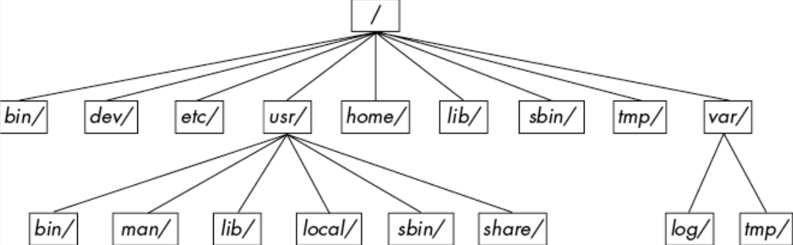

### Hardware  

### Kernel 


### User Processes 

#### Directory Hierarchy 

`/bin` binary, ready-to-run executables eg. ls, cp. created by C compiler  
`/dev` device files  
`/etc` core system configuration directory eg. user password, boot, device, networking and other setup files.
`/lib` libraries that executables can use  
`/proc`  system statistics 
`/run` runtime statistics  
`/sys`  device and system interface  
`/sbin` system excutables, most for root  
`/var` variables for system and excutables  
`/usr` contains a large directory hierarchy   
-`/usr/local` for administrator, similar to /usr  
-`/usr/share` files that work on other kinds of Unix machines


file compression
```
gzip file \\ file.gz
gunzip file 
zcat file \\ same as gunzip -c, write to stdout, original file unchanged

tar cvf archive.tar file1 file2 \\c for create
tar xvf archive.tar

tar zxvf archive.tar.gz \\ z for zcat shortcut 

```

#### Network 

> transport layer and below are primarily handled by the kernel
> Router connects one subnet to another. Has two address: one for local subnet, one for internet link
> ipv4: 4 bytes, ipv6 16 bytes
> hosts normally have two ipv6 address 1)global unicast address(prefix 2000::/3) 2)link-local address(prefix fe80::/10 )

>DNS: /etc/nsswitch.conf -> /etc/hosts -> /etc/resolve.conf
> netstat -n (disable DNS) -t (tcp) -6 (ipv6) -l (listening)
> /etc/services port naming conventions

```
new device on a network 

1. machine broadcasts DHCP to all hosts to get address of DHCP server(usually the router)
2. DHCP server gives machine a *lease* on an address for a certain amount of time. Client can ask to renew the lease.

```

> iptables: admin tool for ipv4/6 packet filtering and NAT
> firewall rules consists of a set of chains of rules eg. INPUT, OUTPUT, FORWARD ...